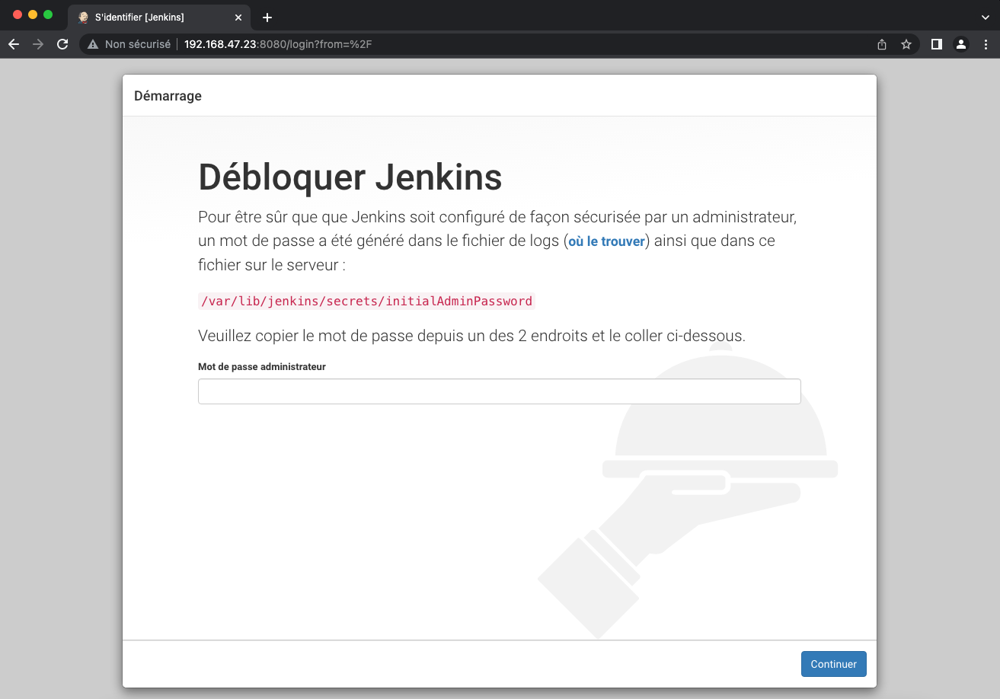
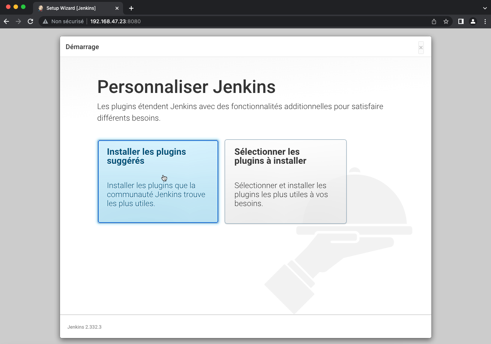
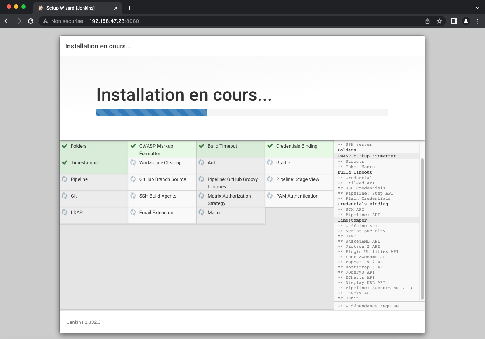
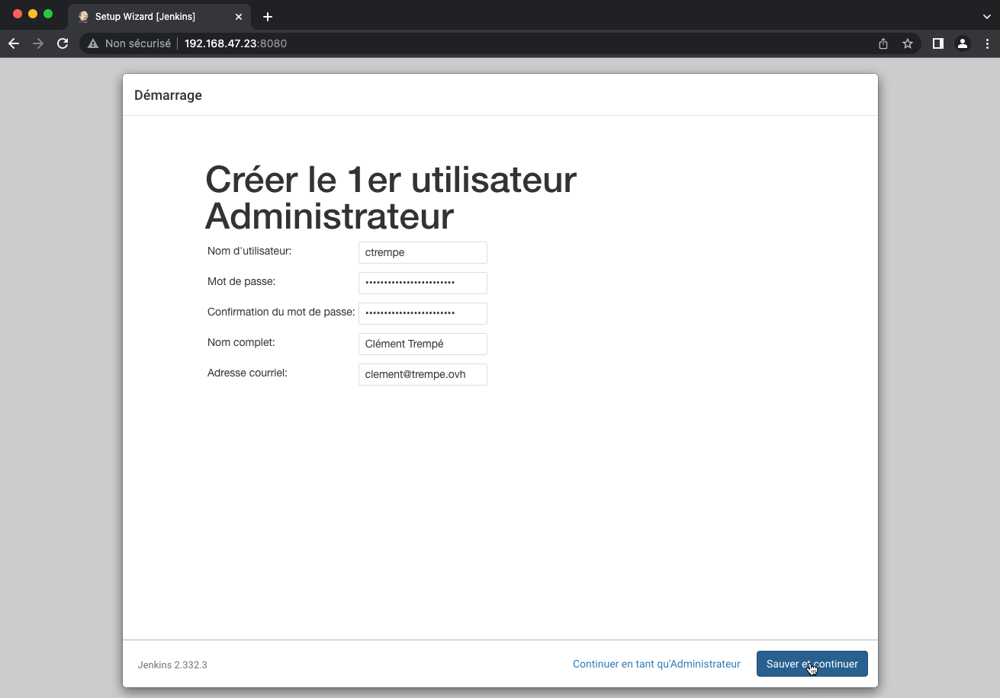
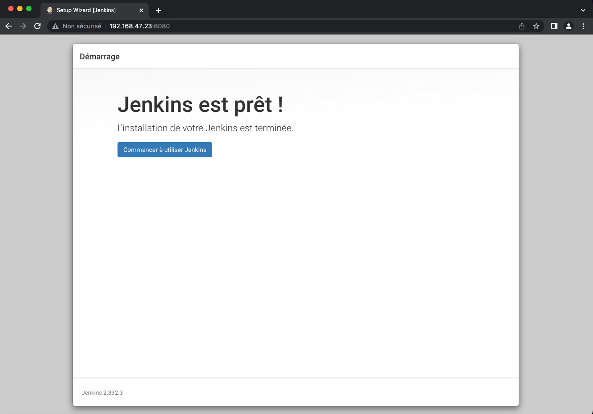

# Introduction et installation de Jenkins

::: details Table des matières
[[toc]]
:::

## Introduction


### Qu'est-ce que Jenkins ?
Jenkins est un outil d'intégration continue et de déploiement continu (CI/CD) développé en Java. Il peut être installé sur Docker et sur tout système disposant d'un JRE (Java Runtime Environment). Un point fort de l'outil : son grand nombre de plugins permettant d'intéragir avec une variété de technologies.

### L'intégration continue (CI) et le déploiement continu (CD)
"L'inté quoi ??"<br>
L'intégration continue est un processus qui va automatiser différents tests sur notre application afin de s'assurer que les modifications apportées dans le code source ne génèrent aucune erreur. En cas de problème lors de cette phase de test, la chaîne de vérification s'arrête et le serveur d'intégration informe les développeurs de l'incident.

Si la série de test est passée avec succès, l'application va être compilée et livrée automatiquement en production, c'est le déploiement continu (CD).

<br>

Pour résumer, l'intégration continue permet donc de :
- Renforcer la productivité de l'équipe de développement
- Trouver plus rapidement les bugs
- Livrer plus rapidement les nouvelles versions de l'application

<br>

> La documentation de Jenkins est disponible [ici](https://www.jenkins.io/doc/)

<br>

## Installation de Jenkins
### Installation des prérequis
Dans un premier temps, commençons par installer la dernière version de Java
```sh
sudo apt-get install openjdk-18-jre
```

<br>

:::warning Attention
Jenkins n'est plus compatible à partir de Java 12, il nous faut donc également installer Java 11 sur notre machine.
:::

Pas de problème, installons donc également Java 11
```sh
sudo apt-get install openjdk-11-jre
```

<br>

Maintenant installons curl, nécessaire à l'installation de Jenkins
```sh
sudo apt-get install curl
```

<br>

Et enfin, installons Git
```sh
sudo apt-get install git
```

<br>

### Installation de Jenkins
Parfait, maintenant nous pouvons installer Jenkins
```sh
curl -fsSL https://pkg.jenkins.io/debian-stable/jenkins.io.key | sudo tee \
  /usr/share/keyrings/jenkins-keyring.asc > /dev/null

echo deb [signed-by=/usr/share/keyrings/jenkins-keyring.asc] \
  https://pkg.jenkins.io/debian-stable binary/ | sudo tee \
  /etc/apt/sources.list.d/jenkins.list > /dev/null

sudo apt-get update

sudo apt-get install jenkins
```

<br>

:::warning Une erreur apparaît lors de l'installation ?

Pas de panique, c'est "normal" 😉<br>
Tout est bien installé, l'erreur est simplement due au fait que Jenkins essaie de se démarrer avec Java 17
:::

<br>

Pour résoudre ce problème, il faut préciser dans le fichier de configuration du service de Jenkins le chemin d'accès à la version de Java avec laquelle il doit démarrer.<br>
Hereusement pour nous, cette ligne est déjà là, mais commentée
```sh
sudo nano /usr/lib/systemd/system/jenkins.service
```

<br>

::: tip
Utilisez la fonction de recherche de Nano : `CTRL + W`<br>
Puis saisissez `JAVA_HOME` et appuyez sur Entrée

:::

<br>

Une fois la ligne trouvée, décommentée là et enregistrez les modifications


<br>

::: tip
C'est aussi dans ce fichier de configuration que nous allons pourvoir configurer le port sur lequel va démarrer notre serveur Jenkins.<br>
Par défaut, Jenkins se lance sur le port `8080`

:::

<br>

A présent, nous allons recharger le fichier de configuration du service
```sh
sudo systemctl daemon-reload
```

<br>

Et nous relançons Jenkins
```sh
sudo systemctl restart jenkins
```

<br>

### Premier démarrage de Jenkins

Rendez-vous maintenant sur le navigateur ! Nous arrivons sur la page de démarrage de Jenkins



<br>

Comme indiqué, commençons par récupérer le mot de passe administrateur généré pour le copier/coller dans le navigateur
```sh
sudo cat /var/lib/jenkins/secrets/initialAdminPassword
```


<br>

Ensuite nous choisissons d'installer les plugins recommandés


<br>

Jenkins va à présent installer les différents plugins suggérés, il suffit de patienter..




<br>

Création du premier compte administrateur




<br>

Configurons à présent l'URL avec laquelle les utilisateurs utiliserons Jenkins. 


<br>

La configuration de Jenkins est enfin terminée !



<br>

Jenkins est maintenant installé sur notre machine. C'est ici que tout commence à présent ! 😎

